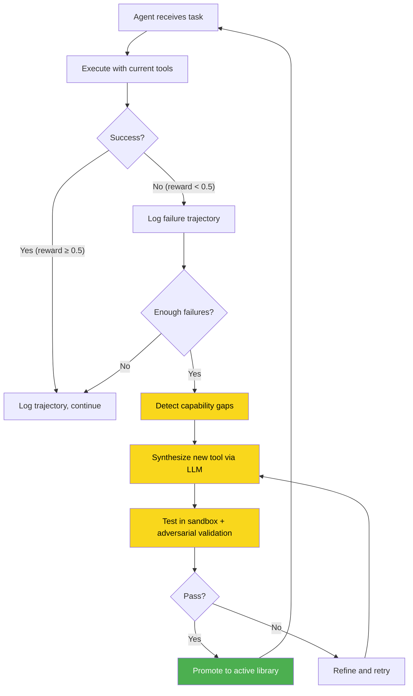
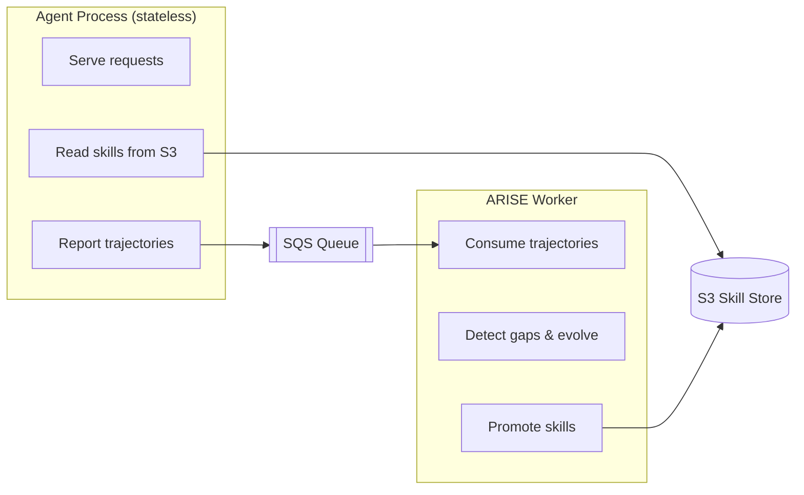

# ARISE — Adaptive Runtime Improvement through Self-Evolution

[](https://pypi.org/project/arise-ai/)
[](https://pypi.org/project/arise-ai/)
[](https://opensource.org/licenses/MIT)

**Your agent works great on the tasks you planned for. ARISE handles the ones you didn't.**

ARISE is a framework-agnostic middleware that gives LLM agents the ability to create their own tools at runtime. When your agent fails at a task, ARISE detects the capability gap, synthesizes a Python tool, validates it in a sandbox, and promotes it to the active library — no human intervention required.

```bash
pip install arise-ai
```

```python
from arise import ARISE
from arise.rewards import task_success

arise = ARISE(
    agent_fn=my_agent,           # any (task, tools) -> str function
    reward_fn=task_success,
    model="gpt-4o-mini",         # cheap model for tool synthesis
)

result = arise.run("Fetch all users from the paginated API")
# Agent fails → ARISE synthesizes fetch_all_paginated tool → agent succeeds
```

---

## How It Works



## What It Looks Like

```
Episode 1  | FAIL  | reward=0.00 | skills=2   Task: "Fetch paginated users with auth"
Episode 2  | FAIL  | reward=0.00 | skills=2
Episode 3  | FAIL  | reward=0.00 | skills=2

[Evolution triggered — 3 failures on API tasks]
  → Synthesizing 'parse_json_response'... 3/3 tests passed ✓
  → Synthesizing 'fetch_all_paginated'... sandbox fail → refine → 1/1 passed ✓

Episode 4  | OK    | reward=1.00 | skills=4   Agent now has the tools it needs
```

---

## Framework Support

| Framework | Status | How |
|-----------|--------|-----|
| **Any function** | Supported | `ARISE(agent_fn=my_func)` — any `(task, tools) -> str` callable |
| **[Strands Agents](https://github.com/strands-agents/sdk-python)** | Supported | `ARISE(agent=strands_agent)` — auto-injects tools alongside your `@tool` functions |
| **Raw OpenAI / Anthropic** | Supported | Wrap API calls in an `agent_fn` — see [examples/](./examples/) |
| **LangGraph, CrewAI** | Planned | v0.2 |

---

## Core Features

### Self-Evolution Pipeline

The core loop: **fail → detect gap → synthesize → test → promote**.

Tools are synthesized by a cheap LLM (gpt-4o-mini), validated in an isolated sandbox with adversarial testing, and version-controlled in SQLite. Every mutation is checkpointed; rollback anytime.

### Distributed Mode

Decouple agent and evolution for stateless deployments (Lambda, ECS, AgentCore):



```python
from arise import create_distributed_arise, ARISEConfig

config = ARISEConfig(
    s3_bucket="my-skills",
    sqs_queue_url="https://sqs.../arise-trajectories",
)

arise = create_distributed_arise(agent_fn=my_agent, reward_fn=task_success, config=config)
```

```bash
pip install arise-ai[aws]   # adds boto3
```

### Skill Registry

Share evolved tools across projects — like npm for agent skills:

```python
from arise.registry import SkillRegistry

registry = SkillRegistry(bucket="my-registry")
registry.publish(skill, tags=["json", "parsing"])

# Other projects can pull proven skills
skill = registry.pull("parse_csv")
```

Set `registry_check_before_synthesis=True` in config and ARISE checks the registry before calling the LLM.

### Multi-Model Routing

Route different synthesis tasks to different models:

```python
config = ARISEConfig(
    model_routes={
        "gap_detection": "gpt-4o-mini",      # cheap
        "synthesis": "claude-sonnet-4-5-20250929",  # expensive, better code
        "refinement": "gpt-4o-mini",
    },
    auto_select_model=True,  # auto-promote best model over time
)
```

### Skill A/B Testing

When ARISE evolves a refined skill, it A/B tests against the original instead of replacing it:

```python
# Automatic — ARISE creates A/B tests during evolution
# Manual — test two versions yourself
from arise.skills.ab_test import SkillABTest

ab = SkillABTest(skill_a=v1, skill_b=v2, min_episodes=20)
# Winner auto-promoted, loser deprecated after min_episodes
```

### Incremental Evolution

Patch existing skills instead of full re-synthesis:

```python
# ARISE does this automatically during evolution:
# 1. Existing skill fails on specific inputs
# 2. forge.patch() applies minimal fix
# 3. Patched version A/B tested against original
# 4. Winner promoted
```

### Reward Learning

Learn reward functions from human feedback:

```python
from arise.rewards.learned import LearnedReward

reward = LearnedReward(min_examples=10, persist_path="./feedback")
reward.add_feedback(trajectory, score=0.9)

# Falls back to task_success until enough examples collected
arise = ARISE(agent_fn=my_agent, reward_fn=reward)
```

---

## Safety

Generated code is untrusted. ARISE validates through multiple layers:

| Layer | What it does |
|-------|-------------|
| **Sandbox** | Subprocess or Docker isolation with timeouts |
| **Test suite** | LLM writes tests alongside the tool |
| **Adversarial testing** | Separate LLM call tries to break it (edge cases, type boundaries, security) |
| **Import restrictions** | `allowed_imports` whitelist blocks `subprocess`, `socket`, etc. |
| **Promotion gate** | Only tools passing all tests become `ACTIVE` |
| **Version control** | SQLite checkpoints; `arise rollback <version>` anytime |
| **Rate limiting** | `max_evolutions_per_hour` caps LLM spend |

See [SECURITY.md](./SECURITY.md) for the full threat model.

---

## Reward Functions

| Function | Scores | Best for |
|----------|--------|----------|
| `task_success` | 1.0 if no error in outcome | General purpose |
| `code_execution_reward` | 1.0 minus 0.25 per error | Tool-use agents |
| `answer_match_reward` | 1.0 exact, 0.7 substring match | Q&A, extraction |
| `efficiency_reward` | Penalizes extra steps | Concise agents |
| `llm_judge_reward` | LLM rates 0–1 (~$0.001/call) | Open-ended tasks |
| `LearnedReward` | Few-shot from human feedback | Custom domains |
| `CompositeReward` | Weighted blend of any of the above | Production |

---

## CLI

```bash
arise status ./skills          # Library stats
arise skills ./skills          # List active skills with metrics
arise inspect ./skills <id>    # View implementation + tests
arise rollback ./skills <ver>  # Rollback to previous version
arise export ./skills ./out    # Export as .py files
arise evolve --dry-run         # Preview what would be synthesized
```

---

## Configuration

```python
from arise import ARISEConfig

config = ARISEConfig(
    model="gpt-4o-mini",           # LLM for synthesis (not your agent's model)
    sandbox_backend="subprocess",   # or "docker"
    sandbox_timeout=30,
    max_library_size=50,
    max_refinement_attempts=3,
    failure_threshold=5,            # failures before evolution
    max_evolutions_per_hour=3,      # cost control
    allowed_imports=["json", "re", "hashlib", "csv", "math"],  # restrict generated code
)
```

---

## Examples

| Example | Description |
|---------|-------------|
| [`quickstart.py`](./examples/quickstart.py) | Math agent evolves statistics tools |
| [`api_agent.py`](./examples/api_agent.py) | HTTP agent evolves auth + pagination (mock server, no deps) |
| [`devops_agent.py`](./examples/devops_agent.py) | DevOps agent evolves log analysis tools |
| [`coding_agent.py`](./examples/coding_agent.py) | Code agent evolves file manipulation tools |
| [`strands_agent.py`](./examples/strands_agent.py) | Strands integration with Bedrock |
| [`demo/agentcore/`](./demo/agentcore/) | Full AgentCore deployment with A2A protocol |

---

## Costs

Each evolution cycle is 3–5 LLM calls with gpt-4o-mini: **~$0.01–0.05 per cycle**. With `max_evolutions_per_hour=3`, worst case ~$0.15/hour.

---

## Dependencies

```bash
pip install arise-ai              # core (just pydantic)
pip install arise-ai[aws]         # + boto3 for distributed mode
pip install arise-ai[litellm]     # + litellm for multi-provider LLM
pip install arise-ai[docker]      # + docker sandbox backend
pip install arise-ai[all]         # everything
```

---

## Related Work

ARISE builds on ideas from [LATM](https://arxiv.org/abs/2305.17126) (LLMs as tool makers), [VOYAGER](https://arxiv.org/abs/2305.16291) (open-ended skill libraries), [CREATOR](https://arxiv.org/abs/2305.14318) (disentangling reasoning from tool creation), [ADAS](https://arxiv.org/abs/2408.08435) (automated agent design), and [CRAFT](https://arxiv.org/abs/2309.17428) (shared tool libraries). ARISE adds the production engineering layer: framework-agnostic integration, sandboxed validation, adversarial testing, version control, distributed deployment, and A/B testing.

## License

MIT
