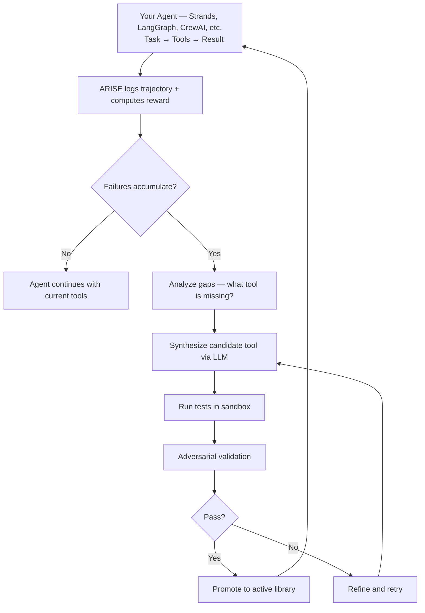
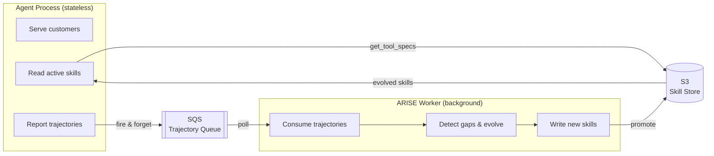

# ARISE — Adaptive Runtime Improvement through Self-Evolution

[](https://pypi.org/project/arise-ai/)
[](https://pypi.org/project/arise-ai/)
[](https://opensource.org/licenses/MIT)

**Your agent works great on the tasks you planned for. ARISE handles the ones you didn't.**

ARISE is a framework-agnostic middleware that sits between your LLM agent and its tool library. When your agent encounters tasks it can't solve with its current tools, ARISE detects the gap, synthesizes a new tool, tests it in a sandbox, and promotes it to the active library — no human intervention required.

ARISE doesn't replace your agent — it gives it the ability to extend itself.

### Framework Compatibility

| Framework | Status | Integration |
|-----------|--------|-------------|
| **Custom `agent_fn`** | Supported | Any `(task, tools) -> str` function works out of the box |
| **[Strands Agents](https://github.com/strands-agents/sdk-python)** | Supported | First-class adapter — pass `Agent` directly via `ARISE(agent=...)` |
| **Raw OpenAI / Anthropic** | Supported | Wrap your API calls in an `agent_fn` — see [examples/api_agent.py](./examples/api_agent.py) |
| **LangGraph** | Planned | Adapter coming in v0.2 |
| **CrewAI** | Planned | Adapter coming in v0.2 |
| **AutoGen** | Planned | Under consideration |

Any framework that can accept a list of callable tools works today via `agent_fn`. First-class adapters (like Strands) add convenience — automatic tool injection, native tool format conversion, etc.

## The Problem

Building an agent is easy. Maintaining its tool library is the bottleneck.

Every time your agent fails at something new, a human engineer has to:
1. Notice the failure (maybe days later, maybe never)
2. Understand what tool is missing
3. Write it, test it, deploy it

This works when you control the environment. It breaks when:
- **Your agent serves many customers** with different internal systems, APIs, and data formats
- **Your agent runs autonomously** and encounters situations you didn't anticipate at build time
- **The long tail of edge cases** isn't worth an engineer's time individually, but collectively costs you

ARISE automates the tool engineering feedback loop for these cases.

## How It Works



## When to Use ARISE

**Use it when** your agent operates in environments you can't fully predict at build time:

- **Multi-tenant platforms** — one agent, many customers with different stacks. The agent learns each customer's API patterns and data formats.
- **Long-running autonomous agents** — ops agents, monitoring agents, data pipeline agents that encounter new situations at 3am without a human to write a quick fix.
- **Exploration agents** — agents navigating unfamiliar codebases, APIs, or datasets where the needed tools depend on what they discover.
- **Reducing tool engineering backlog** — your agent fails on 15 different edge cases. Each isn't worth an engineer's afternoon. ARISE handles the long tail.

**Don't use it when** your agent has a well-defined job with hand-crafted tools that already work. A human writing tools is faster and more reliable for known problems.

## Quick Start

```bash
pip install arise-ai
```

```python
from arise import ARISE, ToolSpec
from arise.rewards import task_success

# Your agent — any function that takes a task and tools, returns a result.
# ToolSpec gives your agent the name, description, parameter schema, and callable.
def my_agent(task: str, tools: list[ToolSpec]) -> str:
    # tools[i].name, tools[i].description — for building prompts
    # tools[i].parameters — JSON Schema for function-calling
    # tools[i].fn(...) or tools[i](...) — invoke the tool
    ...

agent = ARISE(
    agent_fn=my_agent,
    reward_fn=task_success,
    model="gpt-4o-mini",  # cheap model for tool synthesis (not your agent's model)
)

result = agent.run("Fetch all users from the paginated API and count by department")
```

## What Happens in Practice

An API integration agent starts with just `http_get` and `http_post`. It hits tasks requiring auth, pagination, and JSON parsing:

```
[ARISE] Episode 1 | FAIL | reward=0.00 | skills=2
  Task: "Fetch all paginated users with auth"
  Agent has: [http_get, http_post]

[ARISE] Episode 2 | FAIL | reward=0.00 | skills=2
[ARISE] Episode 3 | FAIL | reward=0.00 | skills=2

[ARISE] Evolution triggered — 3 failures on API tasks
[ARISE:forge] Detecting capability gaps...
[ARISE:forge] Synthesizing 'parse_json_response'...
[ARISE:forge] Testing in sandbox (attempt 1/3)... 3/3 passed
[ARISE:forge] Adversarial testing... passed
[ARISE] Skill 'parse_json_response' created and promoted!

[ARISE:forge] Synthesizing 'fetch_all_paginated'...
[ARISE:forge] Testing in sandbox (attempt 1/3)... failed
[ARISE:forge] Refining...
[ARISE:forge] Testing in sandbox (attempt 2/3)... 1/1 passed
[ARISE:forge] Adversarial testing... passed
[ARISE] Skill 'fetch_all_paginated' created and promoted!

[ARISE] Episode 4 | OK | reward=1.00 | skills=4
  Task: "Fetch analytics summary with auth"
  Agent has: [http_get, http_post, parse_json_response, fetch_all_paginated]
```

After 8 episodes, the agent autonomously created: `parse_json_response`, `fetch_all_paginated`, `count_users_by_attribute`, `calculate_total_inventory_value`, `validate_json_response`.

(See [`examples/api_agent.py`](./examples/api_agent.py) — runs a local mock API server, no external dependencies needed.)

## Strands Integration

Pass your Strands `Agent` directly — ARISE auto-detects it and injects evolving tools alongside your existing `@tool` functions:

```python
from strands import Agent, tool
from strands.models import BedrockModel
from arise import ARISE
from arise.rewards import task_success

@tool
def search_logs(query: str) -> str:
    """Search application logs for a pattern."""
    ...

agent = Agent(
    model=BedrockModel(model_id="us.anthropic.claude-sonnet-4-5-20250929-v1:0"),
    tools=[search_logs],
    system_prompt="You are a DevOps assistant.",
)

arise = ARISE(
    agent=agent,            # Pass the Strands Agent directly
    reward_fn=task_success,
    model="gpt-4o-mini",    # cheap model for synthesis, your agent uses Claude
)
```

Your `@tool` functions are preserved. When ARISE evolves new tools, they're added alongside your existing ones. ARISE uses a cheap model (gpt-4o-mini) for tool synthesis — your agent's model is independent.

## Architecture

```
arise/
├── agent.py              # ARISE wrapper — the main class
├── worker.py             # Background evolution worker (SQS consumer)
├── types.py              # Skill, ToolSpec, Trajectory, GapAnalysis
├── config.py             # ARISEConfig
├── llm.py                # LLM abstraction (litellm or raw HTTP)
├── skills/
│   ├── library.py        # SQLite-backed versioned skill store
│   ├── forge.py          # Skill synthesis, refinement, adversarial testing
│   ├── sandbox.py        # Isolated execution (subprocess or Docker)
│   └── triggers.py       # When to enter evolution mode
├── stores/
│   ├── base.py           # Abstract interfaces (SkillStore, TrajectoryReporter)
│   ├── local.py          # Local wrappers around SQLite stores
│   ├── s3.py             # S3-backed skill store (read-only + writer)
│   └── sqs.py            # SQS trajectory reporter (fire-and-forget)
├── trajectory/
│   ├── store.py          # Persistent trajectory logging (SQLite)
│   └── logger.py         # Per-episode trajectory recorder
├── rewards/
│   ├── builtin.py        # task_success, efficiency_reward, llm_judge, etc.
│   └── composite.py      # Combine multiple reward signals
├── prompts/              # All LLM prompts (gap detection, synthesis, etc.)
├── adapters/
│   └── strands.py        # Strands Agents SDK adapter
└── cli.py                # CLI: arise status, skills, inspect, rollback
```

## Safety Model

Generated code is not trusted by default. ARISE applies multiple validation layers before a tool enters your agent's active library:

1. **Sandbox execution** — tools run in isolated subprocesses (or Docker containers) with timeouts and resource limits
2. **Test suite generation** — the LLM writes tests alongside the tool
3. **Adversarial validation** — a separate LLM call tries to break the tool with edge cases, empty inputs, and type boundary tests
4. **Promotion gate** — only tools that pass all tests get promoted to `ACTIVE`; failures stay in `TESTING`
5. **Version control** — every mutation is versioned in SQLite; rollback anytime with `arise rollback <version>`
6. **Rate limiting** — `max_evolutions_per_hour` prevents runaway LLM costs
7. **Skills are just Python** — export and review any tool with `arise inspect <id>` or `arise export`

For production, use the Docker sandbox backend and review promoted skills before deploying.

## CLI

```bash
arise status ./skills          # Library stats: active, testing, deprecated, success rates
arise skills ./skills          # List active skills with performance metrics
arise inspect ./skills <id>    # View full implementation + test suite
arise rollback ./skills <ver>  # Rollback library to a previous version
arise export ./skills ./out    # Export skills as standalone .py files
arise history ./trajectories   # Recent trajectory outcomes
arise evolve --dry-run         # Preview what evolution would do (no LLM calls)
```

## Configuration

```python
from arise import ARISEConfig

config = ARISEConfig(
    model="gpt-4o-mini",           # LLM for tool synthesis (not your agent's model)
    sandbox_backend="subprocess",   # or "docker" for stronger isolation
    sandbox_timeout=30,             # seconds per sandbox run
    max_library_size=50,            # cap on active tools
    max_refinement_attempts=3,      # retries when generated code fails tests

    failure_threshold=5,            # failures before triggering evolution
    max_evolutions_per_hour=3,      # cost control
    max_trajectories=1000,          # auto-prune trajectory history
)
```

## Reward Functions

The `reward_fn` tells ARISE whether the agent succeeded. It takes a `Trajectory` and returns a float between 0.0 (failure) and 1.0 (success). Trajectories with reward < 0.5 count as failures and contribute toward triggering evolution.

### Built-in rewards

```python
from arise.rewards import task_success, code_execution_reward, answer_match_reward, efficiency_reward, llm_judge_reward
```

| Function | How it scores | Best for |
|----------|--------------|----------|
| `task_success` | 1.0 if `metadata["success"]` is truthy or outcome has no "error"; else 0.0 | General-purpose agents where you set `success` in metadata |
| `code_execution_reward` | 1.0 if no step errors; -0.25 per error (min 0.0) | Coding/tool-use agents |
| `answer_match_reward` | 1.0 exact match, 0.7 substring match, 0.0 miss — against `metadata["expected_output"]` | Q&A, data extraction |
| `efficiency_reward` | 1.0 minus 0.1 per extra step (min 0.0) | Penalizing verbose trajectories |
| `llm_judge_reward` | LLM rates trajectory 0.0–1.0 (costs ~$0.001/call) | Open-ended tasks with no ground truth |

### Using built-in rewards

The simplest option — pass metadata to `run()` to drive the reward:

```python
from arise.rewards import task_success

agent = ARISE(agent_fn=my_agent, reward_fn=task_success)

# Option 1: Set success explicitly
result = agent.run("Summarize the report", success=True)

# Option 2: Let task_success check the outcome for errors automatically
result = agent.run("Summarize the report")
```

For answer matching:

```python
from arise.rewards import answer_match_reward

agent = ARISE(agent_fn=my_agent, reward_fn=answer_match_reward)
result = agent.run("What is 2+2?", expected_output="4")
```

### Writing a custom reward

Any `Callable[[Trajectory], float]` works. The trajectory gives you the task, steps, outcome, and any metadata you passed to `run()`:

```python
from arise.types import Trajectory

def my_reward(trajectory: Trajectory) -> float:
    # trajectory.task — the original task string
    # trajectory.outcome — the agent's final output
    # trajectory.steps — list of Step(action, result, error, latency_ms, ...)
    # trajectory.metadata — kwargs passed to agent.run()

    # Example: binary success from an external validator
    expected = trajectory.metadata.get("expected")
    if expected and expected in trajectory.outcome:
        return 1.0
    return 0.0
```

### Combining rewards

Use `CompositeReward` to blend multiple signals with weights:

```python
from arise.rewards import task_success, efficiency_reward, llm_judge_reward, CompositeReward

reward_fn = CompositeReward([
    (task_success, 0.5),       # 50% — did it work?
    (efficiency_reward, 0.2),  # 20% — was it concise?
    (lambda t: llm_judge_reward(t, model="gpt-4o-mini"), 0.3),  # 30% — qualitative
])

agent = ARISE(agent_fn=my_agent, reward_fn=reward_fn)
```

Weights are normalized automatically — `(0.5, 0.2, 0.3)` and `(5, 2, 3)` produce the same result.

## API Costs

Tool synthesis uses a cheap model (gpt-4o-mini by default). Each evolution cycle is 3-5 LLM calls:
- Gap detection (~500 tokens)
- Tool synthesis (~1000 tokens)
- Adversarial test generation (~500 tokens)
- Possible refinement (~800 tokens)

**Estimated cost: $0.01-0.05 per evolution cycle.** With `max_evolutions_per_hour=3`, worst case is ~$0.15/hour. The quickstart example runs for under $0.50 total.

## Examples

| Example | What it shows |
|---------|--------------|
| [`quickstart.py`](./examples/quickstart.py) | Math agent evolves statistics tools |
| [`api_agent.py`](./examples/api_agent.py) | HTTP agent evolves auth, pagination, JSON parsing tools (local mock server) |
| [`devops_agent.py`](./examples/devops_agent.py) | DevOps agent evolves log analysis, metrics parsing tools |
| [`data_analysis_agent.py`](./examples/data_analysis_agent.py) | Data agent evolves anomaly detection, correlation tools |
| [`coding_agent.py`](./examples/coding_agent.py) | Coding agent evolves file search, code manipulation tools |
| [`file_gen_agent.py`](./examples/file_gen_agent.py) | File generation with non-binary rewards (LLM judge + structural validation) |
| [`retrieval_agent.py`](./examples/retrieval_agent.py) | Text agent evolves extraction, summarization tools |

## Distributed Mode

By default, ARISE runs everything in-process with local SQLite. For stateless deployments (Lambda, multi-replica, AgentCore), you can decouple into a **stateless agent** that reads skills from S3 and reports trajectories to SQS, and a **background worker** that consumes trajectories and runs evolution.



### Agent side (stateless)

```python
from arise import create_distributed_arise, ARISEConfig
from arise.rewards import task_success

config = ARISEConfig(
    s3_bucket="my-arise-bucket",
    s3_prefix="prod/skills",
    sqs_queue_url="https://sqs.us-east-1.amazonaws.com/123456789/arise-trajectories",
    aws_region="us-east-1",
    skill_cache_ttl_seconds=30,  # how often to check S3 for new skills
)

agent = create_distributed_arise(
    agent_fn=my_agent,
    reward_fn=task_success,
    config=config,
)

# Agent reads skills from S3, reports trajectories to SQS
# No local SQLite, no in-process evolution
result = agent.run("Handle this customer request")
```

Or wire it up manually:

```python
from arise import ARISE
from arise.stores.s3 import S3SkillStore
from arise.stores.sqs import SQSTrajectoryReporter

agent = ARISE(
    agent_fn=my_agent,
    reward_fn=task_success,
    skill_store=S3SkillStore(bucket="my-bucket", prefix="skills"),
    trajectory_reporter=SQSTrajectoryReporter(queue_url="https://sqs..."),
)
```

### Worker side (background)

```python
from arise.config import ARISEConfig
from arise.worker import ARISEWorker

config = ARISEConfig(
    model="gpt-4o-mini",
    s3_bucket="my-arise-bucket",
    s3_prefix="prod/skills",
    sqs_queue_url="https://sqs.us-east-1.amazonaws.com/123456789/arise-trajectories",
    failure_threshold=5,
)

worker = ARISEWorker(config=config)

# Long-running (ECS/EC2):
worker.run_forever(poll_interval=5)

# Or single invocation (Lambda):
worker.run_once()
```

The worker polls SQS for trajectories, buffers them, and triggers evolution when the failure threshold is met. New skills are written to S3, where agent processes pick them up on their next cache refresh.

### Install with AWS support

```bash
pip install arise-ai[aws]   # adds boto3
```

## Dependencies

Core framework has **one dependency** (`pydantic`). Everything else is optional:

```
pip install arise-ai                # just pydantic
pip install arise-ai[litellm]       # + litellm for multi-provider LLM support
pip install arise-ai[docker]        # + docker for container sandbox
pip install arise-ai[aws]           # + boto3 for distributed mode (S3 + SQS)
pip install arise-ai[all]           # everything
```

Without litellm, ARISE uses raw HTTP requests to any OpenAI-compatible API endpoint.

## New Features

### Skill Registry

`SkillRegistry` is an S3-backed registry for sharing evolved tools across projects — think npm for agent tools. Once a skill proves its value in one project, you can publish it and pull it in another.

```python
from arise.registry import SkillRegistry

registry = SkillRegistry(bucket="my-arise-registry")

# Publish a skill after it has proven itself
registry.publish(skill, tags=["json", "parsing"])

# Before synthesizing, check if a matching skill already exists
entries = registry.search("parse CSV file")
if entries:
    skill = registry.pull(entries[0].name)
```

Enable registry lookups before synthesis via config:

```python
config = ARISEConfig(
    registry_bucket="my-arise-registry",
    registry_check_before_synthesis=True,
)
```

When `registry_check_before_synthesis` is `True`, `SkillForge` checks the registry before invoking the LLM. If a matching skill with `avg_success_rate > 0.7` is found and passes sandbox validation, it is returned immediately — no LLM call needed.

### Multi-Model Synthesis

`LLMRouter` routes different task types to different models. Use a cheap model for gap detection and an expensive one for code synthesis. The router tracks per-model success rates and can auto-select the best model over time.

```python
from arise.llm_router import LLMRouter

router = LLMRouter(
    routes={
        "gap_detection": "gpt-4o-mini",
        "synthesis": "claude-sonnet-4-5-20250929",
        "refinement": "gpt-4o-mini",
    },
    auto_select=True,  # auto-promote best model based on sandbox pass rate
)

arise = ARISE(agent_fn=my_agent, reward_fn=task_success, llm_router=router)
```

### Skill A/B Testing

`SkillABTest` runs two versions of a skill simultaneously and auto-promotes the winner after a configurable minimum number of episodes. When ARISE evolves a refined skill, it creates an A/B test against the original instead of immediately replacing it.

```python
from arise.skills.ab_test import SkillABTest

ab = SkillABTest(skill_a=v1, skill_b=v2, min_episodes=20)

# Each episode, get the assigned variant
variant = ab.get_variant()
# ...run episode...
ab.record(variant, success=True)

# Once concluded, winner is auto-promoted, loser deprecated
if ab.status == "concluded":
    print(f"Winner: {ab.winner.name}")
```

### Incremental Evolution

`forge.patch()` applies a targeted fix to an existing skill based on specific failure patterns, rather than performing a full re-synthesis. Patched skills carry `origin=SkillOrigin.PATCHED` and a `parent_id` pointing to the original.

```python
# When a skill fails on specific inputs, patch it minimally
patched = forge.patch(existing_skill, failures=recent_failure_trajectories)

# Falls back to full synthesis if the patch doesn't pass sandbox validation
```

The patch prompt includes only the failing cases and the current implementation, keeping the LLM context small and the change surgical. Patched skills enter an A/B test against the original before being promoted.

### Reward Learning

`LearnedReward` learns a reward function from human feedback using few-shot LLM prompting. Before enough examples are collected it falls back to `task_success`; once the threshold is reached it scores new trajectories using recent human-scored examples as in-context demonstrations.

```python
from arise.rewards.learned import LearnedReward

reward = LearnedReward(min_examples=10, persist_path="./feedback", model="gpt-4o-mini")

# Collect human feedback
reward.add_feedback(trajectory, score=0.9)

# Use as a standard reward_fn — falls back to task_success until min_examples reached
arise = ARISE(agent_fn=my_agent, reward_fn=reward)
```

Feedback examples are optionally persisted to disk for cross-session learning.

## AgentCore Demo

The `demo/agentcore/` directory contains a self-evolving DevOps agent deployed on Amazon Bedrock AgentCore. It uses the Strands Agents SDK with a Bedrock Claude model and ARISE in distributed mode (S3 skills + SQS trajectories).

**Architecture:**

- Agent process is stateless: reads skills from S3, reports trajectories to SQS via fire-and-forget
- Background ARISE worker consumes trajectories, runs evolution, writes new skills to S3
- Agent starts with zero tools and evolves everything it needs on the fly
- Deployed via `agentcore deploy` using the A2A server protocol over Docker

**Quick deploy:**

```bash
cd demo/agentcore

# Set required environment variables
export ARISE_SKILL_BUCKET=<YOUR_BUCKET>
export ARISE_QUEUE_URL=https://sqs.us-west-2.amazonaws.com/<ACCOUNT_ID>/arise-trajectories

# Deploy to AgentCore
agentcore deploy --region us-west-2

# Invoke
agentcore invoke --agent arise-devops --payload '{"task": "Compute SHA-256 of hello world"}'
```

See `demo/agentcore/README.md` for full setup, IAM requirements, and expected agent evolution output.

## Related Work

ARISE builds on ideas from several research directions:

**LLMs as Tool Makers.** [Cai et al., 2023](https://arxiv.org/abs/2305.17126) showed that LLMs can create reusable tools — a "tool maker" model generates Python functions that a cheaper "tool user" model invokes. ARISE extends this with automated testing, versioning, and a feedback loop driven by real agent failures.

**VOYAGER.** [Wang et al., 2023](https://arxiv.org/abs/2305.16291) demonstrated an open-ended agent in Minecraft that builds a skill library through exploration. ARISE applies the same skill library pattern to real-world software agents, adding sandbox validation and adversarial testing that game environments don't require.

**CREATOR.** [Qian et al., 2023](https://arxiv.org/abs/2305.14318) proposed disentangling abstract reasoning from concrete tool creation, letting LLMs create tools when existing ones are insufficient. ARISE operationalizes this with trajectory analysis to detect when creation should trigger.

**Automated Design of Agentic Systems (ADAS).** [Hu et al., 2024](https://arxiv.org/abs/2408.08435) explored meta-agents that design other agents, including their tools and prompts. ARISE focuses specifically on the tool creation component with a framework-agnostic approach.

**Toolformer.** [Schick et al., 2023](https://arxiv.org/abs/2302.04761) showed LLMs can learn *when* to use tools through self-supervised training. ARISE complements this by addressing *which* tools should exist — creating them at runtime rather than assuming a fixed toolset.

**CRAFT.** [Yuan et al., 2023](https://arxiv.org/abs/2309.17428) introduced a framework where agents create and retrieve tools from a shared library. ARISE adds the production engineering layer: sandboxed testing, adversarial validation, version control, and rollback.

## License

MIT
