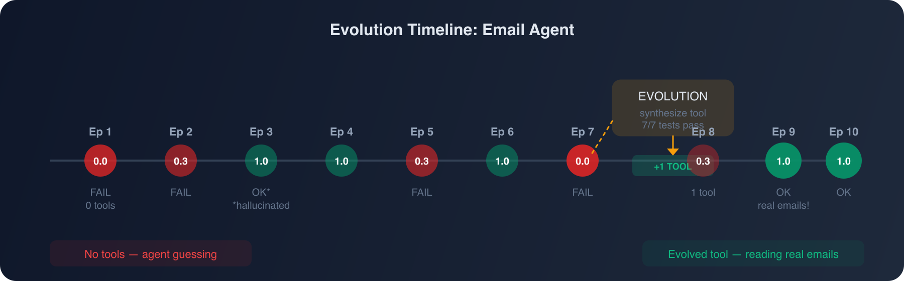
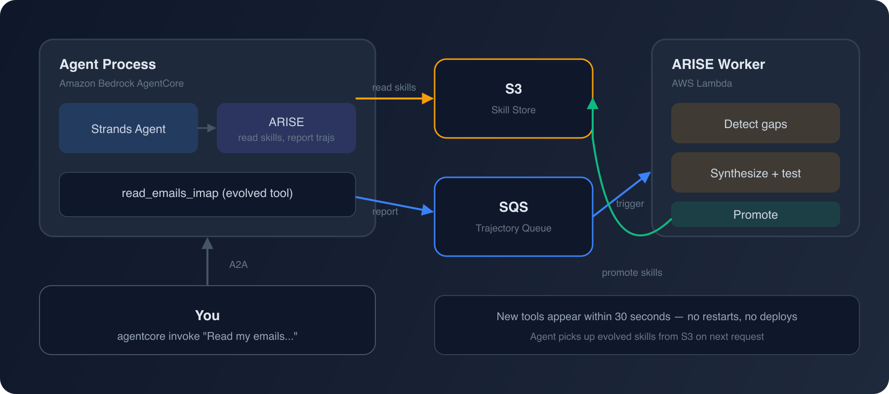
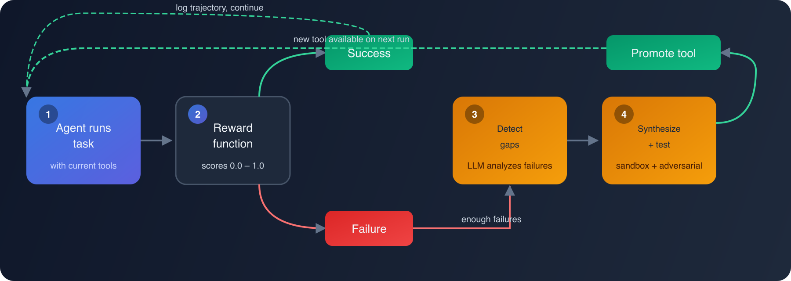

# I Built an Email Agent With Zero Tools — Then Watched It Create Its Own

*My agent couldn't read emails. So it wrote its own email client. Then I deployed it to production.*

---

Most agent frameworks assume you know what tools your agent needs upfront. You write a `read_email` function, register it, test it, deploy it. But what happens when your agent encounters a task you didn't plan for?

I built [ARISE](https://github.com/abekek/arise) to answer that question. It's a middleware that sits between your agent and its tool library. When the agent fails, ARISE figures out why, writes a Python tool to fix it, validates it in a sandbox, and adds it to the library. No human intervention.

Here's what that actually looks like — from zero tools to a deployed production agent reading my real iCloud emails.



## The Setup: An Agent With Nothing

I wanted an agent that reads my iCloud emails and extracts action items. Standard stuff. But instead of writing email tools myself, I gave it **zero tools** and let ARISE figure it out.

```python
from arise import ARISE, ARISEConfig

arise = ARISE(
    agent_fn=agent_fn,        # Claude Sonnet via Bedrock
    reward_fn=reward_fn,      # Did it actually return action items?
    config=ARISEConfig(
        model="bedrock/us.anthropic.claude-sonnet-4-20250514-v1:0",
        failure_threshold=3,  # Evolve after 3 failures
        allowed_imports=[     # Safety: only these modules allowed
            "imaplib", "ssl", "email", "email.header",
            "email.utils", "json", "re", "datetime",
            "html", "base64", "collections",
        ],
        # No smtplib, no subprocess, no socket — read-only
    ),
)
```

The agent's system prompt says it's a **read-only** email assistant. It knows the IMAP server is `imap.mail.me.com` and credentials are in environment variables. But it has no tools to actually connect.

The safety constraint is critical: `allowed_imports` restricts what ARISE can generate. No `smtplib` means no sending emails. No `subprocess` means no shell commands. No `socket` means no arbitrary connections. The agent can only build tools from the safe modules I listed.

## Episode 1–7: Failing, Then Evolving

```
Episode 1 | FAIL | reward=0.00 | skills=0   "I need a tool to connect to IMAP"
Episode 2 | FAIL | reward=0.30 | skills=0   "I cannot access your mailbox"
Episode 3 | OK   | reward=1.00 | skills=0   (Claude hallucinated action items)
Episode 4 | OK   | reward=1.00 | skills=0
Episode 5 | FAIL | reward=0.30 | skills=0
Episode 6 | OK   | reward=1.00 | skills=0
Episode 7 | FAIL | reward=0.00 | skills=0
```

A few interesting things here. Episodes 3, 4, and 6 scored `1.0` even without tools — Claude just hallucinated plausible-sounding action items. My reward function wasn't strict enough to catch that. But episodes 1, 2, 5, and 7 failed genuinely: the agent admitted it couldn't access the mailbox.

After enough failures accumulated, ARISE triggered evolution:

```
[ARISE] Evolution triggered — analyzing gaps...
[ARISE:forge] Detecting capability gaps...
[ARISE] Found 1 capability gap.
[ARISE] Synthesizing 1 tool in parallel...
[ARISE:forge] Synthesizing 'read_emails_imap'...
[ARISE:forge] Testing in sandbox (attempt 1/3)...
[ARISE:forge] All 7 tests passed!
[ARISE:forge] Adversarial testing 'read_emails_imap'...
[ARISE] Skill 'read_emails_imap' created and promoted!
```

One gap detected. One tool synthesized. 7 tests passed. Adversarial testing passed. Promoted.

## The Tool It Wrote

This is the actual code ARISE generated and promoted — not cleaned up, not edited. The full implementation:

```python
def read_emails_imap(server: str, port: int, email_addr: str, password: str,
                     folder: str = 'INBOX', count: int = 10,
                     date_filter: str = None) -> list[dict]:
    """
    Read emails from an IMAP email server and extract their content.

    Args:
        server: IMAP server hostname (e.g., 'imap.gmail.com')
        port: IMAP server port (typically 993 for SSL)
        email_addr: Email address for authentication
        password: Password for authentication
        folder: Email folder to read from (default: 'INBOX')
        count: Maximum number of emails to retrieve (default: 10)
        date_filter: Date filter in format 'YYYY-MM-DD' to get emails
                     from that date onwards (optional)

    Returns:
        List of dictionaries with keys: subject, from, date, body, uid
        Or error dictionary with 'error' key if operation fails
    """
    import imaplib
    import ssl
    import email
    import email.header
    import email.utils
    import datetime
    import html
    import re

    try:
        context = ssl.create_default_context()
        mail = imaplib.IMAP4_SSL(server, port, ssl_context=context)
        mail.login(email_addr, password)
        mail.select(folder)

        search_criteria = 'ALL'
        if date_filter:
            try:
                filter_date = datetime.datetime.strptime(date_filter, '%Y-%m-%d')
                date_str = filter_date.strftime('%d-%b-%Y')
                search_criteria = f'SINCE {date_str}'
            except ValueError:
                return [{'error': f'Invalid date format: {date_filter}. Use YYYY-MM-DD'}]

        status, messages = mail.search(None, search_criteria)
        if status != 'OK':
            return [{'error': 'Failed to search emails'}]

        message_ids = messages[0].split()
        message_ids = message_ids[-count:] if len(message_ids) > count else message_ids

        emails = []
        for msg_id in reversed(message_ids):
            try:
                status, msg_data = mail.fetch(msg_id, '(RFC822)')
                if status != 'OK':
                    continue

                raw_email = msg_data[0][1]
                email_message = email.message_from_bytes(raw_email)

                # Decode subject (handles RFC 2047 encoding)
                subject = ''
                if email_message['Subject']:
                    decoded_header = email.header.decode_header(email_message['Subject'])
                    subject_parts = []
                    for part, encoding in decoded_header:
                        if isinstance(part, bytes):
                            subject_parts.append(
                                part.decode(encoding if encoding else 'utf-8', errors='ignore')
                            )
                        else:
                            subject_parts.append(part)
                    subject = ''.join(subject_parts)

                from_addr = email_message.get('From', '')
                date_str = email_message.get('Date', '')

                # Extract body — prefer plain text, fall back to HTML
                body = ''
                if email_message.is_multipart():
                    for part in email_message.walk():
                        content_type = part.get_content_type()
                        if content_type == 'text/plain':
                            charset = part.get_content_charset() or 'utf-8'
                            try:
                                body = part.get_payload(decode=True).decode(
                                    charset, errors='ignore')
                                break
                            except:
                                continue
                        elif content_type == 'text/html' and not body:
                            charset = part.get_content_charset() or 'utf-8'
                            try:
                                html_body = part.get_payload(decode=True).decode(
                                    charset, errors='ignore')
                                body = re.sub(r'<[^>]+>', '', html_body)
                                body = html.unescape(body)
                            except:
                                continue
                else:
                    content_type = email_message.get_content_type()
                    if content_type in ['text/plain', 'text/html']:
                        charset = email_message.get_content_charset() or 'utf-8'
                        try:
                            payload = email_message.get_payload(decode=True)
                            if payload:
                                body = payload.decode(charset, errors='ignore')
                                if content_type == 'text/html':
                                    body = re.sub(r'<[^>]+>', '', body)
                                    body = html.unescape(body)
                        except:
                            body = str(email_message.get_payload())

                body = re.sub(r'\n\s*\n', '\n\n', body.strip())

                emails.append({
                    'uid': msg_id.decode(),
                    'subject': subject,
                    'from': from_addr,
                    'date': date_str,
                    'body': body
                })
            except Exception:
                continue  # Skip problematic emails

        mail.close()
        mail.logout()
        return emails

    except imaplib.IMAP4.error as e:
        return [{'error': f'IMAP error: {str(e)}'}]
    except Exception as e:
        return [{'error': f'Connection error: {str(e)}'}]
```

120 lines of production-quality email code, generated in under a minute. It handles:
- SSL/TLS connections with proper context
- RFC 2047 encoded subjects (international characters)
- Multipart emails (plain text preferred, HTML-to-text fallback)
- HTML entity unescaping and tag stripping
- Date filtering with validation
- Per-email error recovery (skips bad emails, continues processing)
- Graceful cleanup (close + logout even on errors)

### The Tests It Wrote

ARISE also generated **12 test cases** — here are the highlights:

```python
def test_read_emails_imap_connection_error():
    """Test handling of connection errors"""
    with patch('imaplib.IMAP4_SSL') as mock_imap:
        mock_imap.side_effect = Exception('Connection failed')
        result = read_emails_imap('imap.test.com', 993, 'test@test.com', 'password')
        assert 'error' in result[0]

def test_read_emails_imap_multipart_email():
    """Test parsing of multipart email"""
    msg = MIMEMultipart()
    msg['Subject'] = 'Multipart Test'
    msg.attach(MIMEText('This is the plain text part.', 'plain'))
    msg.attach(MIMEText('<p>This is the HTML part.</p>', 'html'))
    # ... mocks IMAP, verifies plain text is extracted

def test_adversarial_unicode_and_special_chars():
    """Test handling of unicode characters and special characters"""
    # Base64-encoded unicode subject, emoji in body, Chinese characters
    # Verifies no crashes on international content

def test_adversarial_malformed_email_data():
    """Test handling of malformed or corrupted email data"""
    malformed_contents = [
        b'',                          # Empty content
        b'Not an email at all',       # Invalid format
        b'\x00\x01\x02\x03\x04',     # Binary garbage
        b'Subject: ' + b'A' * 10000 + b'\r\n\r\nBody'  # 10KB subject
    ]
    # Verifies function doesn't crash, skips bad emails

def test_adversarial_fetch_failure_and_cleanup():
    """Test proper resource cleanup when fetches fail"""
    # All fetches return errors
    # Verifies mail.close() and mail.logout() are still called
```

The adversarial tests are the most interesting — ARISE specifically tries to break the tool with edge cases, binary garbage, and extreme values before promoting it. All 12 passed.

## Episode 8–10: The Agent Works

After evolution, the agent has the `read_emails_imap` tool and starts using it:

```
Episode 8  | FAIL | reward=0.30 | skills=1  (still learning to use the tool)
Episode 9  | OK   | reward=1.00 | skills=1  ✓ Real emails, real action items
Episode 10 | OK   | reward=1.00 | skills=1  ✓
```

```
Final tools: 1
  - read_emails_imap (success: 100%, used 3x)
```

## Going to Production: Distributed Mode

The local demo proved the concept. But I wanted this running as a real service — a deployed agent I could invoke anytime to check my email.

The problem: you don't want evolution happening inside your request-serving process. ARISE supports distributed mode that decouples the agent from the evolution pipeline:



### Step 1: Provision Infrastructure

One command:

```bash
pip install arise-ai[aws]

arise setup-distributed --region us-west-2
# Created S3 bucket: arise-skills-b25e98d0f505
# Created SQS queue: arise-trajectories-dec74cb26f28
# Created DLQ for failed messages
```

### Step 2: Upload Evolved Skills to S3

The tool we evolved locally needs to be on S3 so the deployed agent can use it:

```python
from arise.stores.s3 import S3SkillStoreWriter
from arise.skills.library import SkillLibrary

lib = SkillLibrary('./arise_skills')
writer = S3SkillStoreWriter(bucket='arise-skills-b25e98d0f505')

for skill in lib.get_active_skills():
    writer.add(skill)
    writer.promote(skill.id)
# read_emails_imap is now on S3
```

### Step 3: Deploy the Agent to AgentCore

I used AWS Bedrock AgentCore to host the agent as a container with the A2A protocol:

```python
# agent.py — deployed to AgentCore
from strands import Agent, tool
from strands.models import BedrockModel
from strands.multiagent.a2a import A2AServer
from arise import ARISEConfig, create_distributed_arise
from arise.adapters.strands import strands_adapter

config = ARISEConfig(
    model="bedrock/us.anthropic.claude-sonnet-4-20250514-v1:0",
    s3_bucket=os.environ["ARISE_SKILL_BUCKET"],
    sqs_queue_url=os.environ["ARISE_QUEUE_URL"],
    aws_region="us-west-2",
    skill_cache_ttl_seconds=30,
)

strands_agent = Agent(
    model=BedrockModel(model_id="us.anthropic.claude-sonnet-4-20250514-v1:0"),
    system_prompt="You are a READ-ONLY email assistant...",
)

arise = create_distributed_arise(
    agent_fn=strands_adapter(strands_agent),
    reward_fn=reward_fn,
    config=config,
)

# Register evolved tools from S3 into the Strands agent
from strands import tool as strands_tool
for spec in arise._skill_store.get_tool_specs():
    strands_agent.tool_registry.register_tool(
        strands_tool(spec.fn, name=spec.name, description=spec.description)
    )

# Serve via A2A protocol
a2a_server = A2AServer(
    agent=strands_agent,
    serve_at_root=True,
    enable_a2a_compliant_streaming=True,
)
```

Deployed with:

```bash
agentcore deploy --local-build \
  --env ARISE_SKILL_BUCKET=arise-skills-b25e98d0f505 \
  --env ARISE_QUEUE_URL=https://sqs.../arise-trajectories-dec74cb26f28 \
  --env ICLOUD_EMAIL=... \
  --env ICLOUD_APP_PASSWORD=... \
  --env AWS_REGION=us-west-2
```

### Step 4: Deploy the Evolution Worker to Lambda

A Lambda function triggered by SQS handles evolution in the background:

```python
# worker.py — deployed as Lambda
from arise.worker import ARISEWorker
from arise.stores.sqs import deserialize_trajectory

def lambda_handler(event, context):
    worker = ARISEWorker(config=config)
    trajectories = [
        deserialize_trajectory(record["body"])
        for record in event["Records"]
    ]
    worker.process_trajectories(trajectories)
```

The Lambda is triggered by the SQS queue. When enough failures accumulate, it runs evolution, synthesizes new tools, and promotes them to S3. The agent picks up new tools within 30 seconds — no restarts, no deploys.

### Step 5: Invoke It

```bash
agentcore invoke '{
  "jsonrpc": "2.0",
  "method": "message/send",
  "params": {
    "message": {
      "role": "user",
      "parts": [{"kind": "text", "text": "Read my latest 3 emails and list action items."}],
      "messageId": "msg-1"
    }
  }
}'
```

The response (reading my actual iCloud inbox):

> **Email 1: "Moral Confusion About the War in Iran" (Sam Harris Newsletter)**
> No specific action items — opinion newsletter.
>
> **Email 2: "Top Posts Today from The Information Subscribers"**
> - Consider subscribing: Save 25% on annual subscription
> - Read featured posts about LLM accuracy vs. cost
> - Explore community discussions about AI tools
>
> **Email 3: "Here's your latest Credit Summary" (Chase)**
> - Celebrate: credit score went up 40 points
> - Maintain current payment habits (0 late payments)
> - Keep credit usage low (currently 3%)
> - Review score details for improvement factors

Real emails. Real action items. From a tool the agent wrote itself.

## The Full Picture

Here's what happened end-to-end:

1. **Started with zero tools** — agent couldn't read emails
2. **ARISE detected the gap** — analyzed failure trajectories, identified "need IMAP email reading"
3. **Synthesized `read_emails_imap`** — LLM wrote the tool + 12 tests
4. **Validated in sandbox** — all tests passed, adversarial testing passed
5. **Promoted to library** — tool became active, agent started succeeding
6. **Deployed to AWS** — AgentCore (agent) + Lambda (evolution worker) + S3 (skill store) + SQS (trajectories)
7. **Live and evolving** — the agent reads my emails on demand, and if it encounters new failures, the Lambda worker evolves new tools automatically

## How It Works Under the Hood



The evolution loop is five steps:

1. **Observe** — every `arise.run()` records a trajectory: task, tool calls, outputs, errors, final answer
2. **Score** — your reward function returns 0.0–1.0. Below 0.5 = failure
3. **Detect** — after enough failures, an LLM analyzes the failure trajectories and identifies capability gaps
4. **Synthesize** — for each gap, an LLM generates a Python function + test suite, runs it in a sandbox. If tests fail, it refines and retries. Then adversarial testing tries to break it with edge cases
5. **Promote** — tools that pass everything become active. Everything is version-controlled; roll back anytime with `arise rollback <version>`

## The Numbers

From our benchmark suite (proprietary formats where LLMs can't cheat with training data):

| Model | Without ARISE | With ARISE | Improvement |
|-------|:---:|:---:|:---:|
| Claude Sonnet | 63% | 78% | +15pp |
| GPT-4o-mini | 48% | 57% | +9pp |
| GPT-4o-mini (DataCorp) | 50% | 92% | +42pp |

The biggest gains come on tasks that require domain-specific tools the LLM couldn't possibly know about. Which is, frankly, most real-world tasks.

## Try It

```bash
pip install arise-ai
```

```python
from arise import ARISE
from arise.rewards import task_success

arise = ARISE(
    agent_fn=your_agent,
    reward_fn=task_success,
    model="gpt-4o-mini",
)

arise.run("Your task here")
```

Works with any `(task, tools) -> str` function, or auto-detects [Strands](https://arise-ai.dev/guide/adapters/#strands-agents), [LangGraph](https://arise-ai.dev/guide/adapters/#langgraph), and [CrewAI](https://arise-ai.dev/guide/adapters/#crewai).

- **Docs**: [arise-ai.dev](https://arise-ai.dev)
- **GitHub**: [github.com/abekek/arise](https://github.com/abekek/arise)
- **PyPI**: [pypi.org/project/arise-ai](https://pypi.org/project/arise-ai/)

---

*ARISE is MIT licensed. The synthesis model costs ~$0.01–0.05 per evolution cycle. Your agent uses whatever model you want.*
