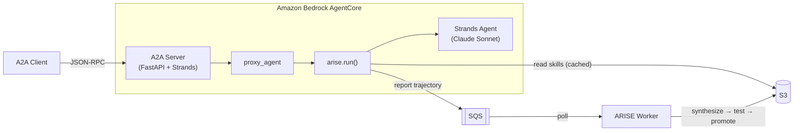

# ARISE DevOps Agent — AgentCore Demo

A self-evolving DevOps agent deployed on [Amazon Bedrock AgentCore](https://aws.amazon.com/bedrock/agentcore/) using the [A2A protocol](https://a2a-protocol.org/). Starts with zero tools, evolves them from failures.

---

## Architecture



**How it works:**

1. Client sends a task via A2A JSON-RPC
2. `proxy_agent` routes it through `arise.run()`
3. ARISE loads active skills from S3, injects them as Strands tools
4. Claude Sonnet attempts the task with available tools
5. ARISE scores the outcome, sends trajectory to SQS
6. Worker consumes SQS, triggers evolution on failures, promotes new skills to S3
7. Next request picks up the new tools automatically

---

## Prerequisites

- AWS account with Bedrock access (Claude Sonnet enabled)
- S3 bucket + SQS standard queue
- OpenAI API key (ARISE uses gpt-4o-mini for tool synthesis)
- Docker (for container deployment)
- Python 3.11+

---

## Setup

```bash
# 1. Create AWS resources
aws s3 mb s3://my-arise-skills --region us-west-2
aws sqs create-queue --queue-name arise-trajectories --region us-west-2

# 2. Set environment variables
export ARISE_SKILL_BUCKET="my-arise-skills"
export ARISE_QUEUE_URL="https://sqs.us-west-2.amazonaws.com/<ACCOUNT_ID>/arise-trajectories"
export OPENAI_API_KEY="sk-..."
export AWS_REGION="us-west-2"

# 3. Install
cd demo/agentcore
pip install -r requirements.txt
pip install -e ../../  # ARISE from source
```

---

## Run Locally

```bash
python agent.py
# A2A server on http://localhost:9000
# Agent card at http://localhost:9000/.well-known/agent.json
```

---

## Deploy to AgentCore

```bash
# Build and deploy container
agentcore deploy --local-build \
  --env ARISE_SKILL_BUCKET=$ARISE_SKILL_BUCKET \
  --env ARISE_QUEUE_URL=$ARISE_QUEUE_URL \
  --env OPENAI_API_KEY=$OPENAI_API_KEY \
  --env AWS_REGION=$AWS_REGION
```

The execution role needs S3 read + SQS send permissions. See IAM policy in the setup section.

---

## Invoking the Agent

### Via `agentcore invoke` (A2A JSON-RPC)

```bash
agentcore invoke '{
  "jsonrpc": "2.0",
  "id": "req-001",
  "method": "message/send",
  "params": {
    "message": {
      "role": "user",
      "parts": [{"kind": "text", "text": "Compute SHA-256 of hello world"}],
      "messageId": "msg-001"
    }
  }
}'
```

### Via Strands A2A client (Python)

```python
from strands.multiagent.a2a import A2AAgent

agent = A2AAgent(endpoint="http://localhost:9000")
result = agent("Compute the SHA-256 hash of 'hello world'")
```

### Via curl (raw JSON-RPC)

```bash
curl -X POST http://localhost:9000/ \
  -H "Content-Type: application/json" \
  -d '{
    "jsonrpc": "2.0",
    "id": "req-001",
    "method": "message/send",
    "params": {
      "message": {
        "role": "user",
        "parts": [{"kind": "text", "text": "Count ERROR lines in: INFO ok\nERROR bad\nERROR fail"}],
        "messageId": "msg-002"
      }
    }
  }'
```

### Response format

```json
{
  "id": "req-001",
  "jsonrpc": "2.0",
  "result": {
    "artifacts": [{
      "name": "agent_response",
      "parts": [{"kind": "text", "text": "b94d27b9934d3e08..."}]
    }],
    "id": "task-uuid",
    "kind": "task",
    "status": {"state": "completed"}
  }
}
```

---

## Running the Worker

The worker consumes trajectories from SQS and triggers evolution when failures accumulate:

```bash
python -c "
from arise.worker import ARISEWorker
from agent import config
ARISEWorker(config=config).run_forever(poll_interval=5)
"
```

---

## Verified Test Results

These tasks were run against the live AgentCore deployment:

| Task | Response | Status |
|------|----------|--------|
| `What is 5 times 7?` | `35` | PASS |
| `Compute SHA-256 of hello world` | `b94d27b9934d3e08a52e52d7da7dabfac484efe...` | PASS |
| `Base64-encode DevOps:password123` | `RGV2T3BzOnBhc3N3b3JkMTIz` | PASS |
| `Count ERROR lines in log` | `2` | PASS |
| `Extract host from JSON` | `db.internal.io` | PASS |

Full evolution pipeline verified: 9 trajectories flowed through SQS, worker consumed 7 into buffer. All tasks succeeded (reward=1.0) — Claude handles these without tools. Evolution triggers only on failures.

---

## Expected Behavior

| Phase | Agent State | What Happens |
|-------|-------------|-------------|
| **Cold start** | 0 skills | Agent uses raw LLM reasoning. Reports `TOOL_MISSING` for tasks needing tools. |
| **After ~5 failures** | 0 → 2-3 skills | Worker detects gaps, synthesizes tools (`parse_csv`, `compute_sha256`), promotes to S3. |
| **Warm** | 3-5 skills | Agent loads evolved tools from S3. Success rate increases. |
| **Steady state** | 5-10 skills | Rich tool library. Handles all task domains reliably. |

---

## IAM Policy

The AgentCore execution role needs:

```json
{
  "Statement": [
    {
      "Effect": "Allow",
      "Action": ["s3:GetObject", "s3:ListBucket"],
      "Resource": ["arn:aws:s3:::my-arise-skills", "arn:aws:s3:::my-arise-skills/*"]
    },
    {
      "Effect": "Allow",
      "Action": ["sqs:SendMessage"],
      "Resource": "arn:aws:sqs:us-west-2:<ACCOUNT_ID>:arise-trajectories"
    },
    {
      "Effect": "Allow",
      "Action": ["bedrock:InvokeModel"],
      "Resource": "*"
    }
  ]
}
```

---

## Files

| File | Description |
|------|-------------|
| `agent.py` | A2A server + ARISE proxy agent + Strands |
| `tasks.py` | 20 benchmark tasks across 5 domains |
| `reward.py` | Pattern-matching reward function |
| `Dockerfile` | Container image (arm64) |
| `requirements.txt` | Python dependencies |
