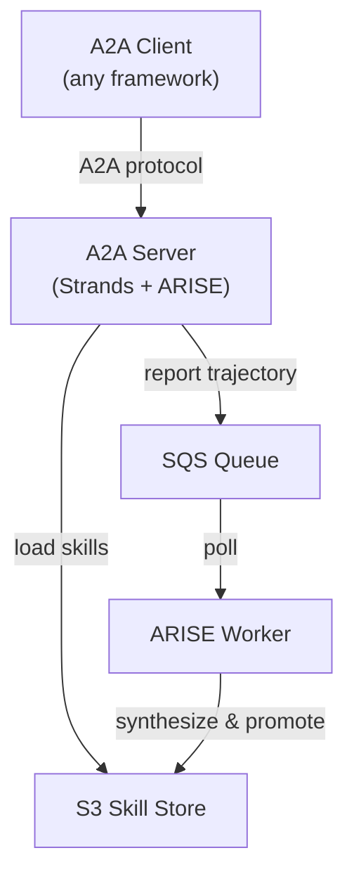

# ARISE DevOps Agent — A2A Server Demo

A **self-evolving DevOps agent** served as an A2A (Agent-to-Agent) server.
The agent starts with zero tools and evolves them autonomously: when it fails
a task, ARISE synthesizes a new Python tool, validates it in a sandbox, and
promotes it to S3. On the next request the agent has the new tool available.

---

## Architecture



**Flow:**
1. A2A client sends a task via the A2A protocol.
2. ARISE loads active skills from S3 (cached with TTL).
3. Strands Agent (Claude Sonnet on Bedrock) attempts the task.
4. ARISE scores the outcome and sends the trajectory to SQS.
5. The worker polls SQS and triggers evolution when failures accumulate.
6. New skills land in S3; the next request picks them up.

---

## Prerequisites

- AWS account with Bedrock access (Claude Sonnet enabled)
- S3 bucket + SQS queue
- OpenAI API key (for ARISE skill synthesis via gpt-4o-mini)
- Python 3.11+

---

## Setup

```bash
# Create AWS resources
aws s3 mb s3://my-arise-skills --region us-west-2
aws sqs create-queue --queue-name arise-trajectories --region us-west-2

# Set env vars
export ARISE_SKILL_BUCKET="my-arise-skills"
export ARISE_QUEUE_URL="https://sqs.us-west-2.amazonaws.com/123456789012/arise-trajectories"
export OPENAI_API_KEY="sk-..."
export AWS_REGION="us-west-2"

# Install
cd demo/agentcore
pip install -r requirements.txt
pip install -e ../../  # ARISE from source
```

---

## Run

```bash
# Start A2A server
python agent.py

# Agent card at http://localhost:9000/.well-known/agent.json
```

### Connect from any A2A client

```python
from strands.multiagent.a2a import A2AAgent

agent = A2AAgent(endpoint="http://localhost:9000")
result = agent("Compute the SHA-256 hash of 'hello world'")
```

### Run the worker (processes trajectories, evolves skills)

```bash
python -c "
from arise.worker import ARISEWorker
from agent import config
ARISEWorker(config=config).run_forever()
"
```

### Deploy to AgentCore

```bash
agentcore deploy
```

---

## Expected behavior

| Phase | What happens |
|-------|-------------|
| **Cold start** | No tools. Agent uses raw LLM reasoning, often says `TOOL_MISSING`. |
| **After ~5 failures** | Worker synthesizes tools (`parse_csv`, `compute_sha256`, etc.) to S3. |
| **Warm** | Agent loads evolved tools. Success rate increases. |
| **Steady state** | Rich tool library, handles all tasks reliably. |

---

## Files

| File | Description |
|------|-------------|
| `agent.py` | Strands Agent + ARISE + A2A server |
| `tasks.py` | 20 benchmark tasks with expected output patterns |
| `reward.py` | Pattern-matching reward function |
| `requirements.txt` | Dependencies |
