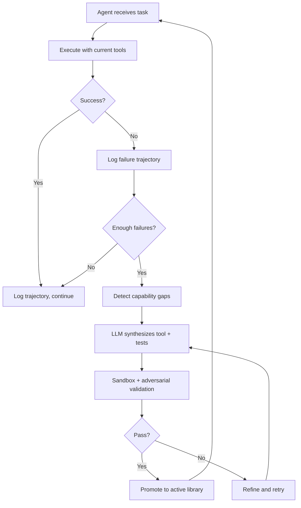

ARISE sits between your agent and its tool library. Every time your agent runs a task, ARISE records what happened, evaluates how well it went, and — when enough failures accumulate — synthesizes new tools to fill the gaps.

## The Evolution Loop

## The 5 Steps in Detail

### 1. Observe

Every call to `arise.run(task)` produces a `Trajectory`: a record of the task, every tool call the agent made (with inputs, outputs, and errors), the final outcome, and the reward score.

Trajectories are stored locally in SQLite (or sent to SQS in distributed mode). ARISE keeps the most recent `max_trajectories` records (default: 1,000).

### 2. Score

After each episode, the `reward_fn` you provide evaluates the trajectory and returns a float in `[0.0, 1.0]`. Scores below `0.5` are counted as failures. ARISE watches two conditions:

- **Failure threshold**: if the last `failure_threshold` episodes (default: 5) are all failures, evolution triggers.
- **Plateau detection**: if success rate hasn't improved by `plateau_min_improvement` (default: 5%) over the last `plateau_window` (default: 10) episodes, evolution triggers even without a failure streak.

### 3. Detect

When evolution triggers, ARISE sends the recent failure trajectories to an LLM (the cheap `model` you set in config, not your agent's model). The LLM analyzes:

- What tasks failed
- What errors appeared in tool calls
- What tools the agent tried to call that didn't exist
- What the agent said it needed but couldn't do

The output is a list of `GapAnalysis` objects — each with a description, evidence, a suggested function name, and a suggested signature.

### 4. Synthesize

For each detected gap, ARISE:

1. **Checks the registry** (if `registry_check_before_synthesis=True`) — if a proven skill already exists there, pulls it instead of calling the LLM.
2. **Calls the LLM** to write a Python function implementing the tool, along with a test suite.
3. **Runs the tests in a sandbox** (subprocess or Docker). If tests fail, ARISE refines and retries up to `max_refinement_attempts` times.
4. **Runs adversarial validation** — a separate LLM call specifically tries to break the tool with edge cases, type boundaries, and security-probing inputs.
5. If adversarial validation fails, ARISE refines again and re-tests.

For existing skills that are failing on specific inputs, ARISE instead runs a **patch** — a minimal targeted fix — and starts an A/B test between the original and the patched version.

Synthesis runs in parallel (up to `max_synthesis_workers=3` concurrent threads).

### 5. Promote

A skill that passes both the sandbox tests and adversarial validation is marked `ACTIVE` and added to the tool library. On the next `arise.run()` call, the agent has access to the new tool.

Every promotion is checkpointed in SQLite with a version number. You can roll back to any previous state with `arise rollback <version>` or `arise.rollback(version)`.

## Skill Lifecycle

`TESTING` → `ACTIVE` → `DEPRECATED`

- **TESTING**: synthesized but not yet promoted (failed adversarial tests, or in A/B test)
- **ACTIVE**: promoted, available to the agent
- **DEPRECATED**: removed (lost A/B test, manually removed, or rollback)

## A/B Testing

When ARISE patches an existing skill, it doesn't replace it immediately. Instead, both versions run concurrently — each episode randomly uses one variant. After `min_episodes` (default: 20), the variant with the higher success rate wins and is promoted; the loser is deprecated.

## Cost Control

Evolution is rate-limited by `max_evolutions_per_hour` (default: 3). Each evolution cycle costs 3–5 LLM calls with gpt-4o-mini, so the worst case is roughly **$0.01–0.15/hour** for tool synthesis.

:::note[The synthesis model is separate from your agent's model]
ARISE uses a cheap model (`gpt-4o-mini` by default) for gap detection and tool synthesis. Your agent continues using whatever model you configured it with. You can customize routing with `model_routes` in `ARISEConfig`.
:::