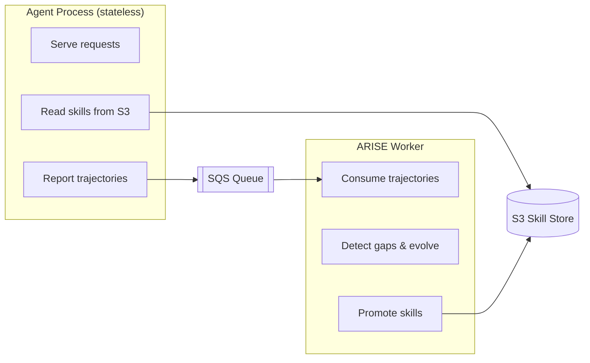

In local mode, ARISE stores skills in SQLite and runs evolution in-process. This works well for a single agent process but doesn't scale to stateless deployments (Lambda, ECS, AgentCore) where multiple instances share a tool library.

Distributed mode decouples the agent from the evolution process using S3 (shared skill store) and SQS (trajectory queue).

## Architecture



## Quick Setup

### 1. Provision AWS resources

One command creates the S3 bucket, SQS queue, and DLQ, then saves the config to `.arise.json`:

```bash
pip install arise-ai[aws]

arise setup-distributed --region us-west-2
# Created S3 bucket: arn:aws:s3:::arise-skills-a1b2c3d4e5f6
# Created SQS DLQ:   arn:aws:sqs:us-west-2:123456789:arise-trajectories-abc-dlq
# Created SQS queue: arn:aws:sqs:us-west-2:123456789:arise-trajectories-abc
# Config saved to .arise.json
```

Or from Python:

```python
from arise.distributed import setup_distributed

config = setup_distributed(region="us-west-2")
# Returns ARISEConfig with s3_bucket and sqs_queue_url populated
```

To tear down:

```bash
arise setup-distributed --destroy
```

### 2. Configure the agent process

Use `create_distributed_arise()` to build an ARISE instance that reads from S3 and reports to SQS:

```python
from arise import create_distributed_arise, ARISEConfig
from arise.rewards import task_success

config = ARISEConfig(
    s3_bucket="arise-skills-a1b2c3d4e5f6",
    sqs_queue_url="https://sqs.us-west-2.amazonaws.com/123456789/arise-trajectories-abc",
    aws_region="us-west-2",
    skill_cache_ttl_seconds=30,   # how often to refresh skills from S3
)

arise = create_distributed_arise(
    agent_fn=my_agent,
    reward_fn=task_success,
    config=config,
)

# Use exactly like local ARISE
result = arise.run(task)
```

In distributed mode, `arise.run()` fetches tools from S3 (with cache) and sends trajectories to SQS. Evolution does not run in-process.

### 3. Run the worker

The worker polls SQS, buffers trajectories, and runs evolution when triggered. Run it as a separate process (ECS task, EC2 instance, or background thread):

```python
from arise import ARISEConfig
from arise.worker import ARISEWorker

config = ARISEConfig(
    s3_bucket="arise-skills-a1b2c3d4e5f6",
    sqs_queue_url="https://sqs.us-west-2.amazonaws.com/123456789/arise-trajectories-abc",
    aws_region="us-west-2",
    model="gpt-4o-mini",
    failure_threshold=5,
    verbose=True,
)

worker = ARISEWorker(config=config)
worker.run_forever(poll_interval=5)  # long-running loop for ECS/EC2
```

For Lambda (invoked on SQS trigger):

```python
from arise.worker import ARISEWorker
from arise.stores.sqs import deserialize_trajectory

def lambda_handler(event, context):
    worker = ARISEWorker(config=config)
    trajectories = [
        deserialize_trajectory(record["body"])
        for record in event["Records"]
    ]
    worker.process_trajectories(trajectories)
```

## ARISEWorker Reference

```python
class ARISEWorker:
    def __init__(self, config: ARISEConfig): ...

    def run_forever(self, poll_interval: int = 5) -> None: ...
    def run_once(self) -> int: ...
    def process_trajectories(self, trajectories: list[Trajectory]) -> None: ...
```

| Method | Description |
|--------|-------------|
| `run_forever(poll_interval=5)` | Long-running loop for ECS/EC2. Polls SQS every `poll_interval` seconds, buffers trajectories, and triggers evolution when thresholds are met. |
| `run_once()` | Poll SQS once, buffer trajectories, evolve if triggered. Returns count of messages processed. Use for cron-style invocations. |
| `process_trajectories(trajectories)` | Directly process a list of `Trajectory` objects without SQS polling. Use in Lambda handlers where SQS delivers messages via event trigger. |

## IAM Permissions

**Agent process** needs:
```json
{
  "Action": ["s3:GetObject", "s3:ListBucket"],
  "Resource": ["arn:aws:s3:::arise-skills-*"]
},
{
  "Action": ["sqs:SendMessage"],
  "Resource": ["arn:aws:sqs:*:*:arise-trajectories-*"]
}
```

**Worker process** additionally needs:
```json
{
  "Action": ["s3:PutObject"],
  "Resource": ["arn:aws:s3:::arise-skills-*"]
},
{
  "Action": ["sqs:ReceiveMessage", "sqs:DeleteMessage"],
  "Resource": ["arn:aws:sqs:*:*:arise-trajectories-*"]
}
```

## AgentCore Deployment

See [`demo/agentcore/`](https://github.com/abekek/arise/tree/main/demo/agentcore) for a complete example deploying ARISE with AWS AgentCore and the A2A protocol.

:::note[Skill cache TTL]
Agent processes cache skills from S3 for `skill_cache_ttl_seconds` (default: 30). After the worker promotes a new skill, agents pick it up within 30 seconds without restarting.
:::